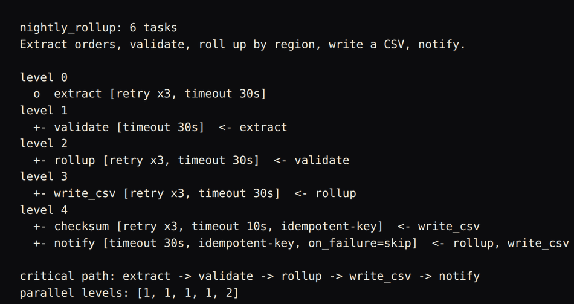
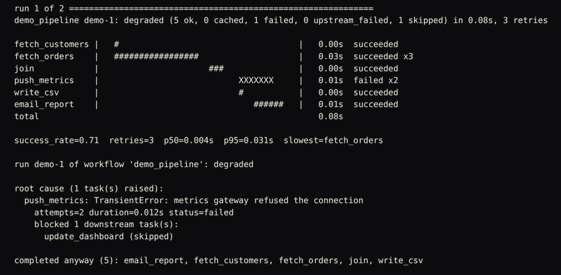
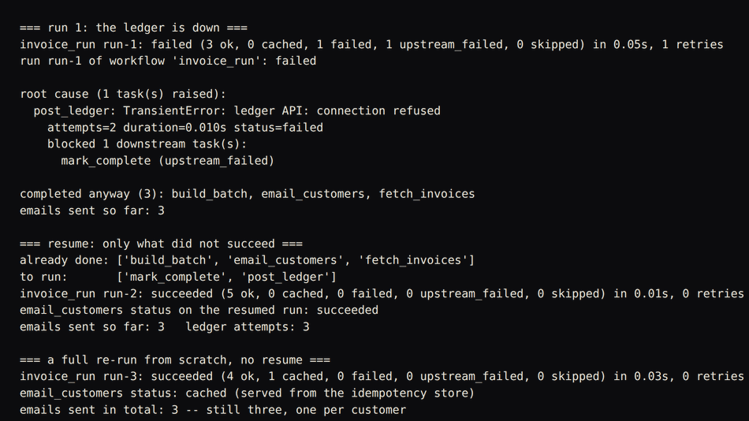

# flowforge

**A workflow engine for the automation you actually have to operate: retries
that know what is worth retrying, idempotency so a re-run does not re-send,
partial-failure semantics you can act on, and a run you can resume.**


---

## The problem

The script works. It worked for four months. Then, one Tuesday at 03:00:

- The API returned a 503 for ninety seconds. The script died, so the report
  never went out, and nobody noticed until Thursday.
- Somebody fixed the API and re-ran the script. It emailed 280 customers a
  second invoice, because step 4 had already run before step 5 failed.
- The `try/except: pass` that was added to "make it more robust" now means a
  failed extract produces an empty report instead of an error. The run is
  green. The numbers are wrong.
- Half the workflow did finish. Nobody can tell which half, because the log is
  `print()` statements interleaved from three threads with no run id.

None of that is a scheduling problem, and none of it is fixed by drawing a
prettier DAG. It is retries, idempotency, partial failure, and observability.
That is what this library is about.

---

## Screenshots


`./tools/flowforge graph examples/workflows/nightly_rollup.yaml`: the DAG for the bundled nightly rollup workflow, grouped by the level each task can run at, with each task's retry, timeout and idempotency policy, the critical path, and how wide each level is.


The run section of `./tools/flowforge --demo`. Six tasks, one of which fails twice against a simulated 503. The timeline shows what ran in parallel and where the retries went; the root-cause block names the task that raised, how many attempts it took, and which downstream task was dropped as a result.


`python3 examples/resume_after_failure.py`: an invoice run that fails when the ledger API refuses the connection, a resume that re-runs only the two unfinished tasks, and a full re-run from scratch. The customer emails are sent exactly three times across all three runs, because the idempotency store serves the repeat.

---

## What it does

- **A DAG of tasks** with topological ordering, level grouping for parallel
  execution, orphan detection, and cycle errors that print the actual cycle:
  `workflow contains a cycle: build -> test -> deploy -> build`.
- **Partial-failure semantics that distinguish three different incidents.** A
  task that raised is `failed`. A task that never got the chance is
  `upstream_failed`. A task a policy chose to drop is `skipped`. Independent
  branches keep running. An operator can tell what happened without reading code.
- **Retry policies that retry the right things.** Fixed, exponential, and
  exponential-with-jitter (deterministic under an injected RNG), plus a circuit
  breaker. A `ValueError` from a malformed row is not retried five times; a 503
  is. Every retry decision is deadline-aware and recorded with a reason.
- **Idempotency that survives a crash.** Content-addressed keys, a pluggable
  store (in-memory or JSON file, written atomically), and an explicit
  three-state protocol: `completed` (reuse it), `failed` (safe to run again),
  `started` (we were killed mid-flight and genuinely do not know -- you choose
  the policy).
- **Durable run state and resume.** Every status, attempt count, timing, input
  and output digest, and error goes to JSON after each transition.
  `flowforge resume` re-runs only what did not succeed, and restores upstream
  outputs so downstream tasks can still read them.
- **Timeouts and cancellation.** Per-task timeouts, a whole-run deadline, and a
  cooperative cancel token. A task's timeout starts when it starts running, not
  when it was queued.
- **A cron parser we wrote**, timezone-aware via `zoneinfo`, with explicit and
  tested DST behaviour: a job in the spring-forward gap fires once at the first
  instant that exists; a job in the fall-back hour fires once, on the first pass.
- **Connectors** for HTTP, webhooks (signed, with a stable delivery id), shell,
  filesystem, CSV, and SMTP -- each of which **declares whether it is
  idempotent**, and the engine uses that declaration.
- **Observability that answers questions.** JSON-lines logs with the run id and
  task id on every line, an ASCII Gantt render of the run, metrics (success
  rate, p50/p95, retry counts), and `explain_failure()`, which names the
  root-cause task and everything it blocked.
- **Workflows in Python or YAML.** The YAML loader reports the offending key
  *and line*, and suggests the right key when you typo `depends` for
  `depends_on`.

No required dependencies. Nothing here needs a broker, a database, a scheduler
daemon, or a network.

---

## Quickstart

```bash
git clone https://github.com/Pratyush150/workflow-automation-engine
cd workflow-automation-engine
./tools/flowforge --demo          # a full run, twice, offline, in under a second
```

That is the whole setup. No install, no services, no configuration.

```bash
python3 -m pytest -q                                    # 171 tests, ~3 seconds
python3 examples/resume_after_failure.py                # crash, resume, no duplicate emails
./tools/flowforge validate examples/workflows/nightly_rollup.yaml
./tools/flowforge graph    examples/workflows/nightly_rollup.yaml
./tools/flowforge next-runs "*/15 9-17 * * mon-fri" --tz Europe/London
```

In Python:

```python
from flowforge import Executor, ExponentialBackoff, Workflow, content_key

wf = Workflow("nightly")

@wf.task("extract", retry=ExponentialBackoff(max_attempts=3), timeout=30)
def extract(ctx):
    return [{"id": 1, "amount": 10.0}]

@wf.task("email", depends_on=["extract"],
         idempotency_key=lambda ctx: content_key("email", rows=ctx.result("extract")))
def email(ctx):
    rows = ctx.result("extract", expect=list)
    return send_report(rows)          # runs once per distinct content, ever

state = Executor(wf).run({"date": "2026-02-17"})
print(state.status.value)             # succeeded | degraded | failed | cancelled
```

---

## How it works

```
   definition                 planning              execution              durability
   ----------                 --------              ---------              ----------

  @wf.task(...)  ---+
  Python           |
                   +-->  Workflow  -->   Dag        +-------------------+
  workflows/*.yaml |         |        topological   |     Executor      |
  dsl.py         --+         |        sort, levels, |  thread pool,     |
                             |        cycle path,   |  ready set,       |
  connectors/    ------------+        orphans       |  timeouts,        |
  http shell csv                                    |  cancellation     |
  filesystem email                                  +-------------------+
  webhook mock                                        |      |       |
                                                      |      |       |
                          per attempt  <--------------+      |       +--------> RunState
                          retry.py                           |                  status, attempts,
                          policy + deadline + circuit breaker |                  timings, digests,
                                                              |                  error, blocked_by
                          before the side effect  <-----------+                       |
                          idempotency.py                                              v
                          content key -> begin/complete/fail             .flowforge/runs/*.json
                          memory or JSON-file store                      + *.results.json
                                                                                      |
                                     observability.py  <---------------------+        |
                                     JSON logs, Gantt, metrics,              |        |
                                     explain_failure                         +--------+
                                                                              resume reads
                                                                              both files
```

**The data flow, once through.**

1. A workflow is a set of tasks, each with an id, a callable, `depends_on`, and
   its policy: retry, timeout, `on_failure`, tags, and an optional idempotency
   key. `dag.py` derives the graph from `depends_on` -- there is no second edge
   list to fall out of sync.
2. Before anything runs, the graph is validated. A dangling dependency is
   reported before a cycle (a typo is the likelier cause), and a cycle error
   carries the real path through the offending tasks.
3. The executor keeps a ready set. A task becomes ready when every dependency
   has succeeded, been served from the idempotency cache, or failed under an
   `on_failure=continue` policy. Ready tasks go to the pool; with
   `max_workers=1` the same code path runs them one at a time.
4. Each task runs inside a wrapper that computes its idempotency key, asks the
   store whether that key already completed, and only then executes -- under
   the retry policy, against the run deadline, through a circuit breaker if the
   task opted into one with a `circuit:<name>` tag.
5. A task sees only the outputs of the tasks it declared. Reaching sideways
   into a task you did not declare is not possible, so parallel execution
   cannot introduce a read/write race through the context.
6. Every outcome is folded into the run state on the main thread and written to
   JSON. Outputs also go to a result archive, which is what makes resume able
   to hand a restored value to a downstream task.
7. When a task fails, `_propagate_blocked` walks to a fixpoint and marks the
   blast radius: `upstream_failed` for a hard failure, `skipped` for a
   policy-tolerated one, each stamped with the task that blocked it.

---

## Worked example

`./tools/flowforge --demo` -- real output, pasted, not invented. The demo runs
the same workflow twice. The orders API fails twice with a 503 before it works;
the metrics push always fails under `on_failure=skip`; the email step carries a
content-addressed key.

```
level 0
  o  fetch_customers [retry x3, timeout 5s]
  o  fetch_orders [retry x4, timeout 5s]
level 1
  +- join  <- fetch_customers, fetch_orders
level 2
  +- push_metrics [retry x2, on_failure=skip]  <- join
  +- write_csv  <- join
level 3
  +- email_report [idempotent-key]  <- join, write_csv
  +- update_dashboard  <- push_metrics

lint: task 'push_metrics' retries up to 2 times but is not declared idempotent and has no idempotency key; a retry after a partial success will repeat its side effect
lint: task 'push_metrics' retries but has no timeout; one hung attempt blocks the run for as long as the call hangs

run 1 of 2 =============================================================
demo_pipeline demo-1: degraded (5 ok, 0 cached, 1 failed, 0 upstream_failed, 1 skipped) in 0.10s, 3 retries

fetch_customers |   #                                    |   0.00s  succeeded
fetch_orders    |   #############                        |   0.03s  succeeded x3
join            |                     ##                 |   0.00s  succeeded
push_metrics    |                          XXXXX         |   0.01s  failed x2
write_csv       |                          #             |   0.00s  succeeded
email_report    |                              ######    |   0.01s  succeeded
total                                                        0.10s

success_rate=0.71  retries=3  p50=0.004s  p95=0.031s  slowest=fetch_orders

run demo-1 of workflow 'demo_pipeline': degraded

root cause (1 task(s) raised):
  push_metrics: TransientError: metrics gateway refused the connection
    attempts=2 duration=0.011s status=failed
    blocked 1 downstream task(s):
      update_dashboard (skipped)

completed anyway (5): email_report, fetch_customers, fetch_orders, join, write_csv
```

Read the timeline: `fetch_orders` took three attempts (`x3`) and its bar is
thirty times longer than its neighbour's, because two of those attempts were
503s followed by backoff. `push_metrics` failed and took `update_dashboard`
with it -- as `skipped`, not as a hidden success -- while the report and the
email completed anyway. The run is `degraded`, which the CLI turns into exit
code **2**: not a success, not a total failure, and not something cron should
treat as fine.

The second run, with the same inputs:

```
demo_pipeline demo-2: degraded (4 ok, 1 cached, 1 failed, 0 upstream_failed, 1 skipped) in 0.06s, 1 retries

fetch_customers |  ##                                    |   0.00s  succeeded
fetch_orders    |   #                                    |   0.00s  succeeded
join            |               ####                     |   0.00s  succeeded
push_metrics    |                        XXXXXXXX        |   0.01s  failed x2
write_csv       |                        ##              |   0.00s  succeeded
email_report    |                               =        |   0.00s  cached
total                                                        0.06s

emails actually sent across both runs: 1 (the second run reused the idempotency key)
api calls made: 4 (2 failed with 503 and were retried)
```

`email_report` is `cached` (`=` in the chart). One email, across two full runs
of a workflow that sends email.

### Crash, then resume

`python3 examples/resume_after_failure.py` -- the run emails three customers,
then the ledger API is down:

```
=== run 1: the ledger is down ===
invoice_run run-1: failed (3 ok, 0 cached, 1 failed, 1 upstream_failed, 0 skipped) in 0.07s, 1 retries

root cause (1 task(s) raised):
  post_ledger: TransientError: ledger API: connection refused
    attempts=2 duration=0.010s status=failed
    blocked 1 downstream task(s):
      mark_complete (upstream_failed)

completed anyway (3): build_batch, email_customers, fetch_invoices
emails sent so far: 3

=== resume: only what did not succeed ===
already done: ['build_batch', 'email_customers', 'fetch_invoices']
to run:       ['mark_complete', 'post_ledger']
invoice_run run-2: succeeded (5 ok, 0 cached, 0 failed, 0 upstream_failed, 0 skipped) in 0.02s, 0 retries
email_customers status on the resumed run: succeeded
emails sent so far: 3   ledger attempts: 3

=== a full re-run from scratch, no resume ===
invoice_run run-3: succeeded (4 ok, 1 cached, 0 failed, 0 upstream_failed, 0 skipped) in 0.05s, 0 retries
email_customers status: cached (served from the idempotency store)
emails sent in total: 3 -- still three, one per customer
```

Two independent guards, because they protect against different mistakes:
**resume** stops you re-running the workflow, and the **idempotency key** stops
you re-running the task.

### Structured logs

Every line carries the run id and, inside a task, the task id and attempt:

```json
{"ts": "2026-09-02T10:32:19.980915+00:00", "level": "info", "event": "task.start", "run_id": "20260902T103219-8ce37c", "task_id": "extract", "attempts_allowed": 3}
{"ts": "2026-09-02T10:32:19.981132+00:00", "level": "warning", "event": "task.attempt_failed", "run_id": "20260902T103219-8ce37c", "task_id": "extract", "attempt": 1, "error_type": "TransientError", "error": "read timeout from source db", "decision": "retry:attempt=2", "delay": 0.01}
{"ts": "2026-09-02T10:32:19.991588+00:00", "level": "info", "event": "task.succeeded", "run_id": "20260902T103219-8ce37c", "task_id": "extract", "attempts": 2, "duration": 0.0109}
```

### The same workflow in YAML

```yaml
name: nightly_rollup
schedule:
  cron: "15 3 * * mon-fri"
  tz: Europe/London
defaults:
  retry: {attempts: 3, strategy: exponential, base: 0.05, max_delay: 2}
  timeout: 30
tasks:
  - id: extract
    uses: python:steps:extract
    idempotent: true
  - id: validate
    uses: python:steps:validate_rows
    depends_on: [extract]
    retry: 1              # bad input is permanent: one attempt
  - id: notify
    uses: python:steps:notify
    depends_on: [rollup, write_csv]
    idempotency_key: "notify:{param:run_date}"
    on_failure: skip      # losing the email must not lose the report
```

Typo a key and the loader tells you where, and what you probably meant:

```
$ ./tools/flowforge validate examples/workflows/nightly_rollup.yaml   # with 'depends' on line 60
invalid: nightly_rollup.yaml line 60 key 'depends': unknown task key 'depends'; did you mean 'depends_on'?. Allowed: ['depends_on', 'description', 'id', 'idempotency_key', 'idempotent', 'on_failure', 'retry', 'tags', 'timeout', 'uses', 'with']
```

---

## What this handles that a tutorial does not

| Failure mode | What most home-made automation does | What flowforge does |
|---|---|---|
| A step fails halfway | Whole script aborts, or every step is wrapped in `except: pass` | Downstream is `upstream_failed`; independent branches finish; the run is `failed` or `degraded`, never a silent green |
| Re-running after a failure | Repeats every side effect | Resume runs only unfinished tasks; content-addressed keys stop the task itself repeating |
| A malformed row | Retried 5 times, then a timeout in the alert instead of the real error | `PermanentError` is never retried; the message names the bad value |
| A dependency is down | Every workflow in the fleet retries it into the ground | Circuit breaker opens after N consecutive failures and fails fast until it recovers |
| A hung call | Blocks the run indefinitely | Per-task timeout plus a run deadline; the task is marked `timed_out`, its cancel token is set, and a late result is logged and discarded |
| Retry storms | Every client retries on the same interval | Jittered exponential backoff, deterministic under an injected RNG so it is testable |
| The process is killed mid-send | Nobody knows whether the email went | The key stays `started`; on the next run you choose `rerun`, `skip`, or `error` rather than guessing |
| Clocks change | A nightly job runs twice in November and not at all in March | The cron implementation has explicit, tested spring-forward and fall-back behaviour |
| "Which half ran?" | Grep interleaved `print()` output | JSON-lines logs keyed by run and task, a Gantt render, and `explain_failure()` |
| A truncated upload | Ingests half a file, silently | The filesystem watcher only reports files whose mtime has been stable for a window |
| A CSV from Excel | `float("1,234.00")` raises, or a BOM breaks the first column | `utf-8-sig`, accounting negatives, currency symbols, thousands separators |

---

## Limitations

Worth knowing before you build on it.

- **Single process.** State, idempotency and scheduling are local to one host.
  Two machines running the same workflow against a `JsonFileStore` will race.
  The `IdempotencyStore` protocol is four methods; putting Postgres or Redis
  behind it is the intended path, and is not written here.
- **Timeouts on threads are cooperative.** Python cannot kill a thread. On
  timeout the task is marked `timed_out`, its cancel token is set, and the
  engine stops waiting -- but a task blocked in an uninterruptible C call keeps
  running in the background until it returns. For a hard kill, run the work in
  a subprocess (the `shell` connector does, and its timeout is real).
- **Threads, not processes.** CPU-bound tasks will contend on the GIL. This is
  built for IO-bound automation: APIs, files, databases, mail.
- **No scheduler daemon.** `schedule.py` computes fire times; something has to
  call it. Point cron or a systemd timer at `flowforge run`, or write a loop.
  We think that is the right split -- a long-lived scheduler is a second thing
  to keep alive.
- **Resume needs JSON-serialisable outputs.** A task returning a database
  connection cannot have its output restored. The engine records that honestly
  and the downstream task fails with the reason, rather than seeing `None`.
- **The YAML loader parses a subset** -- mappings, sequences, scalars, inline
  collections, `|` blocks, comments. No anchors, aliases or custom tags.
  Install PyYAML and pass `loader="pyyaml"` if you need the full language.
- **No web UI.** The CLI, the JSON state files and the Gantt render are the
  interface.
- **`explain_failure` is not root-cause analysis.** It reports which task
  raised and what that blocked. Why the API returned 503 is still your job.

---

## Repository layout

```
src/flowforge/
  dag.py             graph: topological sort, levels, cycle paths, orphans
  task.py            Task, TaskContext, Step, CancelToken, on_failure policies
  workflow.py        the container, plus lint() for policy mistakes
  executor.py        the engine: ready set, pool, timeouts, blast radius
  retry.py           policies, jitter, deadline awareness, circuit breaker
  idempotency.py     content keys, begin/complete/fail, memory + JSON stores
  state.py           durable RunState, StateStore, ResultArchive
  schedule.py        cron parser, intervals, one-shots, DST rules
  observability.py   JSON logs, timeline, Gantt, metrics, explain_failure
  dsl.py             YAML subset loader and schema validation with line numbers
  cli.py             run, validate, graph, resume, history, next-runs, --demo
  demo.py            the self-contained demo workflow
  connectors/        http, webhook, shell, filesystem, csv_excel, email_smtp, mock
examples/            four runnable workflows + a YAML one
docs/                PRODUCTION_NOTES.md
tests/               12 files, 171 tests, offline and deterministic
tools/flowforge      CLI entry point that runs from a checkout
```

Further reading: [docs/PRODUCTION_NOTES.md](docs/PRODUCTION_NOTES.md) --
at-least-once vs exactly-once, why a naive retry duplicates side effects, when
cron stops scaling, how to make a workflow safely re-runnable, and how to alert
on silent partial failure.

---

## Related work

Part of a set of engineering repos we maintain:

| repo | what it is |
|---|---|
| [llm-faq-assistant](https://github.com/Pratyush150/llm-faq-assistant) | Retrieval-grounded FAQ assistant with citations and an eval harness |
| [industrial-automation-suite](https://github.com/Pratyush150/industrial-automation-suite) | Modbus/OPC-UA acquisition, alarms, historian and a live dashboard |
| [robot-sim-test-harness](https://github.com/Pratyush150/robot-sim-test-harness) | Scenario-driven regression testing for robots in simulation |
| [flight-log-analyzer](https://github.com/Pratyush150/flight-log-analyzer) | PX4 ULog / ArduPilot log forensics with a ranked findings report |
| [px4-mavlink-companion](https://github.com/Pratyush150/px4-mavlink-companion) | MAVLink bridge, stale-telemetry watchdog, offboard control |
| [fleet-ops-dashboard](https://github.com/Pratyush150/fleet-ops-dashboard) | Web dashboard for monitoring a fleet of robots and drones |

Site: [pratyush150.github.io](https://pratyush150.github.io)

## License

MIT. See [LICENSE](LICENSE).
